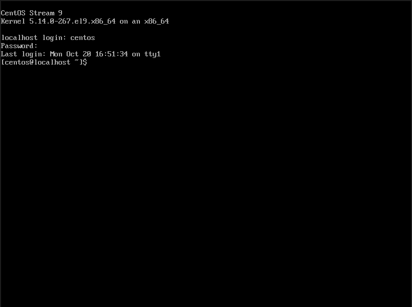
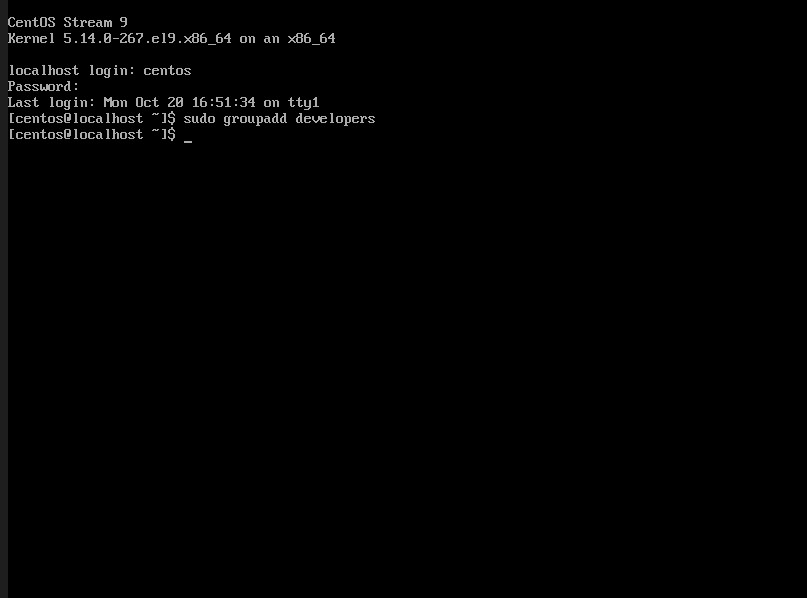
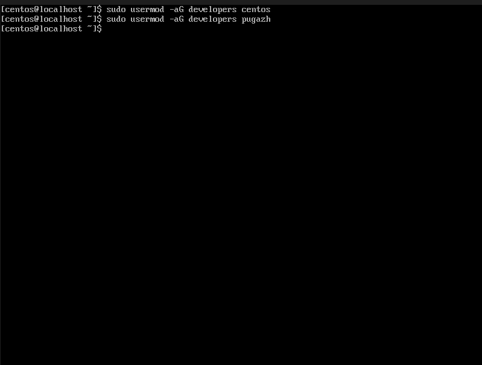
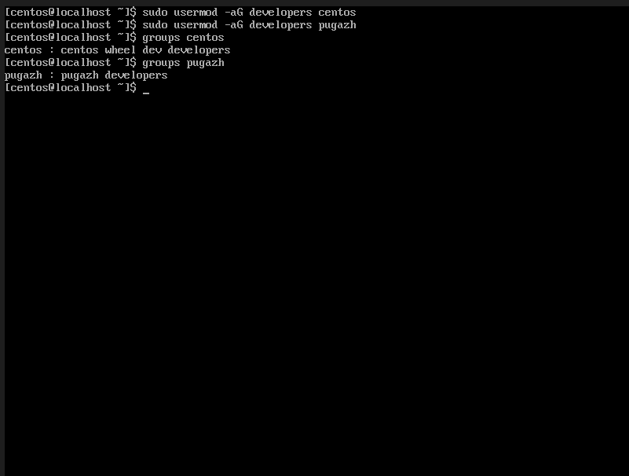

# Linux-Users-Groups

## Introduction
**Linux is an open-source operating system that allows users to manage files, users, and system processes through commands. These commands are executed in a terminal.**

---------------------------------------------
| Command      | Description                 |
|-------------|-----------------------------|
| ls          | To list files or directories|
| cd          | To change/open a directory  |
| pwd         | To show current directory   |
| mkdir       | To create a new directory   |
| rmdir       | To remove an empty directory|
| touch       | To create an empty file     |
| cat         | To display file content     |
| echo        | To create file with content |
| cp          | To copy files or directories|
| mv          | To move/rename files        |
| rm          | To delete files             |
| whoami      | To show current user        |
| id          | To display user ID, group ID|
| groups      | To list groups of a user    |
| chmod       | To change file permissions  |
| chown       | To change file ownership    |
| su          | To switch user              |
| sudo        | To run commands as root     |
---------------------------------------------

## What is a user in linux ?

**A user in Linux is an account that allows a person or a process to log in and use the system.**

*Each user has:*

1. Their own username

2. A unique ID number (called UID)

3. A home directory (example: /home/centos)

4. Their own permissions and access rights to files

## Types of Users in Linux

| Type                            | Description                                                                        | Example                      |
| ------------------------------- | ---------------------------------------------------------------------------------- | ---------------------------- |
| **Root User (Superuser)**       | Has full control of the system. Can install, remove, or modify anything.           | `root`                       |
| **Normal User**                 | Can use the system but has limited permissions.                                    | `centos`, `pugazh`           |
| **System/User Daemon Accounts** | Created by Linux for running background services like databases, web servers, etc. | `daemon`, `mail`, `www-data` |

| Role             | Description                       | Access Level |
| ---------------- | --------------------------------- | ------------ |
| Normal User      | Can only access own files         | Limited      |
| Group User       | Can access shared group folders   | Shared       |
| Root (Superuser) | Can access and control everything | Full         |


## What is a Group in Linux?

**A group in Linux is a collection of users.**
**It helps manage permissions for multiple users at once.**

**Instead of giving access to each user individually, you can assign permissions to a group, and all users in that group automatically get the same access.**

*Why Groups Are Useful*

1. Easier to manage shared access to files or folders.

2. Helps organize users by role or department.

3. Reduces administrative work — one permission change affects all group members.

| Type                                | Description                                                                                    | Example                         |
| ----------------------------------- | ---------------------------------------------------------------------------------------------- | ------------------------------- |
| **Primary Group**                   | Automatically assigned when a user is created. Files created by the user belong to this group. | Usually same as username        |
| **Secondary (Supplementary) Group** | Additional groups that a user can join. Used for shared access.                                | e.g., `developers`, `sharedgrp` |

*Group Details Are Stored In*

*All groups are listed in the file:*

```sh
/etc/group
```

*To view all groups:*

```sh 
cat /etc/group
```


*Example output:*
```sh
centos:x:1000:
developers:x:1001:pugazh
```

**Basic Group Commands**

| Command                               | Description                          | Example                          |
| ------------------------------------- | ------------------------------------ | -------------------------------- |
| `sudo groupadd groupname`             | Creates a new group                  | `sudo groupadd devgrp`           |
| `sudo usermod -aG groupname username` | Adds a user to a group               | `sudo usermod -aG devgrp pugazh` |
| `groups username`                     | Shows which groups a user belongs to | `groups pugazh`                  |
| `sudo gpasswd -d username groupname`  | Removes user from a group            | `sudo gpasswd -d pugazh devgrp`  |

## How to create a group in linux ?

**Basic Syntax**
```sh
sudo groupadd groupname
```

1. sudo → gives you administrator (root) permission.

2. groupadd → command used to create a new group.

3. groupname → name of the group you want to create.

---
**Step 1: Boot into linux and login with your account**

---

**Step 2: Let’s create a group named developers:**
```sh
sudo groupadd developers
```


---

**Output: (No message means success)**
**Verify Group Creation**
*You can check it using:*
```sh
cat /etc/group | grep developers
```
*You’ll see something like:*
```sh
developers:x:1002:
```

---

**Add Users to the Group**

*After creating a group, you can add a user to it:*
```sh
sudo usermod -aG developers username
```

*Example:*
```sh
sudo usermod -aG developers centos
```
*Add all user of the group using this command*


---
**Check Group Membership**

*To confirm a user is in the group:*
```sh
groups centos
```

*Output:*
```sh
centos : centos developers
```

---

## How to create a shared folder for a group in Linux

*Create a Shared Folder*

**Step 1: Use the mkdir command to make a folder everyone in the group can access.**

```sh
sudo mkdir /sharedgrp
```

*This creates a directory named /shared at the root level.*


---
**Step 3: Change the Group Ownership**

*Now, assign that folder to your group (for example, developers):*
```sh
sudo chown :developers /shared
```

*chown → change ownership command*

*:developers → means group ownership only (not user)*

*You can verify it using:*
```sh
ls -ld /shared
```

*Output might look like:*
```sh
drwxr-xr-x. 2 root developers 4096 Oct 20 10:45 /shared
```
*Step 4: Give Permission to the Group*

*Allow full read, write, and execute access to group members:*
```sh
sudo chmod 770 /shared
```

*7 → read, write, execute (for owner)*

*7 → read, write, execute (for group)*

*0 → no access (for others)*

*Now only the owner and group members can access it.*

---

**Step 5: Enable Automatic Group Inheritance**

*So that new files inside /shared belong to the same group automatically:*

```sh 
sudo chmod g+s /shared
```


*Check again:*
```sh
ls -ld /shared
```

*You’ll see an s in the group permission area:*
```sh
drwxrws---. 2 root developers 4096 Oct 20 10:50 /shared
```

*That s means — new files/folders created here will inherit the group developers.*

---

